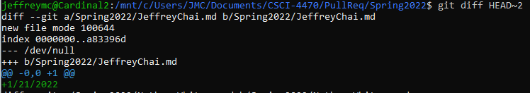

# Lab 02 Report - Git
Name: Jeffrey Chai

Date: January 24, 2022

## Part 1

Repository Link: https://github.com/jeffreychai/lab2part1

Visualize Diagram

gitk:

git log:

The two provide the same information in different formats.

## Part 2

Repository Link: https://github.com/jeffreychai/Spoon-Knife

I completed the first four levels of Learn Git Branching.
It was interesting to learn about rebase.

Screenshots:

Level 1:

Level 2:

Level 3:

Level 4:

Final Result:

## Part 3

Repository Link: https://github.com/jeffreychai/PullReq

Base Repo Pull Request: https://github.com/wdturner/PullReq/pull/127

Note: During Friday, Professor Turner said that I could do HEAD~2 due to a misunderstanding about when to clone.

git diff:

git tag:

Project Ideas link for Breakout Room #1 Common Repository: https://github.com/jeffreychai/OSSProjectIdeas

Project Ideas Pull Request: https://github.com/wdturner/OSSProjectIdeas/commit/6e01c921eb18444a415e88dca6b72431ec3fc55f
