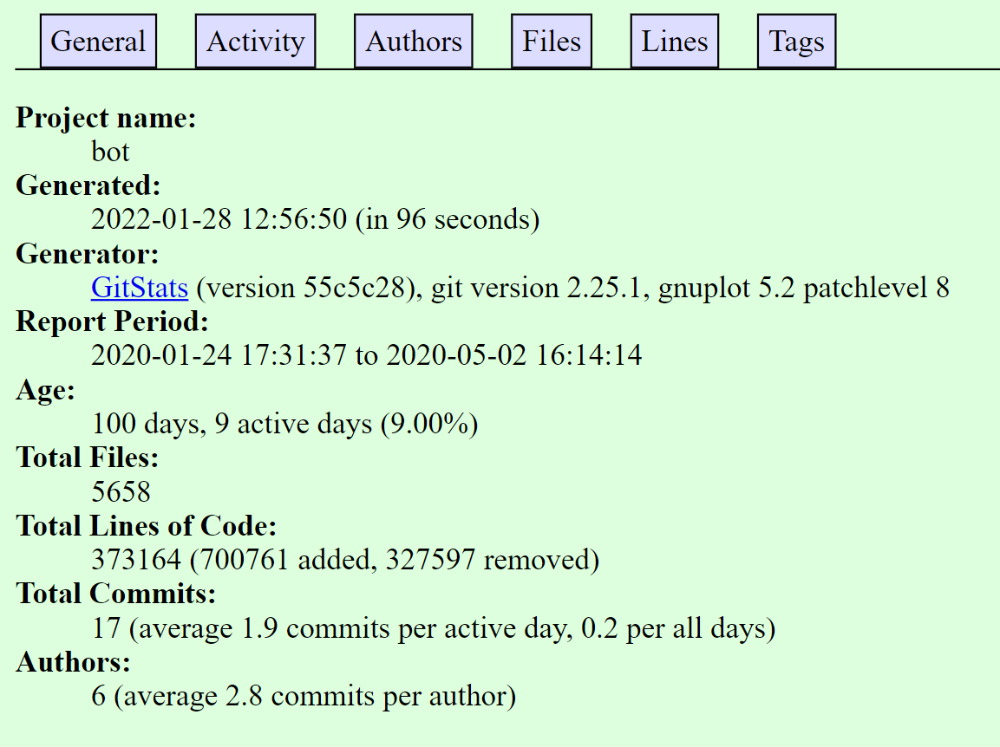
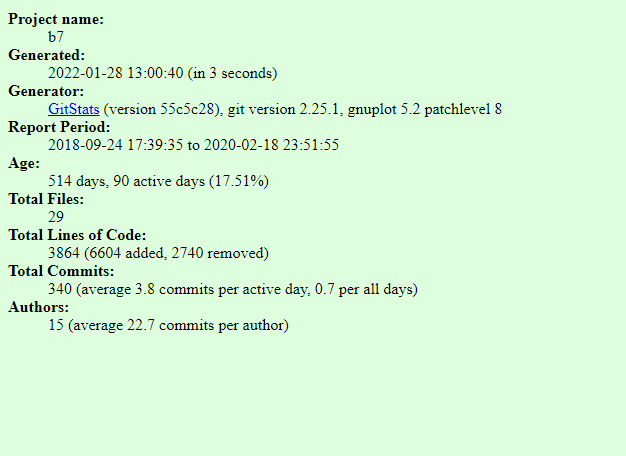
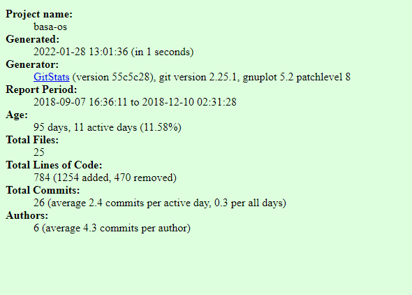
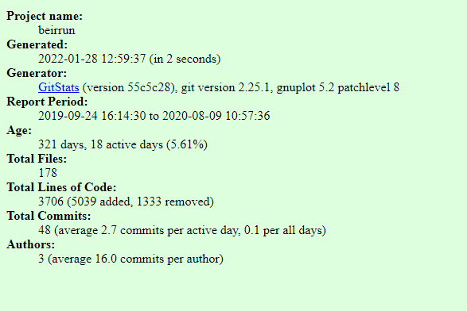
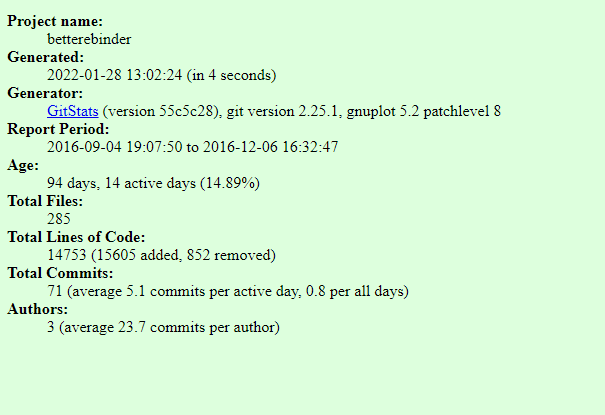

# Lab 3 - Documentation and Community

# Part 1 - Documentation

## 2)
I documented this in the repo wiki.

Link: https://github.com/jeffreychai/oss-repo-template/wiki

## 3) Latex Practice - AOPS

First Problem: $\sqrt{1 + 2 \sqrt{1+3 \sqrt{1+4 \sqrt{1+...}}}}$

Second Problem: $\sqrt{2}^{\sqrt{2}^{\sqrt{2}^{\sqrt{2}...}}}$

## 4) Hadamard Matrix

$\begin{bmatrix}
1 & 1 & 1 & 1 \\
-1 & 1 & -1 & 1 \\
-1 & -1 & 1 & 1 \\
1 & -1 & -1 & 1
\end{bmatrix}$

# Part 2 - Community

My table consisted of four students. We were table 7.
The RCOS projects that we were assigned are B.O.T, B7, BASA-OS, BeirRun, and Better eBinder.

## 4)

In this portion, we used information reported by Github.

### B.O.T

- 3 contributors
- 373,124 lines of code
- First Commit: January 24th 2020
- Last Commit: May 2nd 2020
- Current Branches: (master)

### B7

- 10 contributors
- 3,861 lines of code
- First Commit: September 24th 2018
- Last Commit: Febuary 19th 2020
- Current Branches: (master)

### BASA-OS

- 4 contributors
- 784 lines of code
- First Commit: September 7th 2018
- Last Commit: December 10th 2018
- Current Branches: (master)

### BeirRun

- 3 contributors
- 22,163 lines of code
- First Commit: September 24th 2019
- Last Commit: August 9th 2020
- Current Branches: (master)

### Better eBinder

- 2 contributors
- 14,753 lines of code
- First Commit: October 11th 2016
- Last Commit: December 6th 2016
- Current Branches: (master)

## 5) Gitstats

In this portion, we used information reported by gitstats.

### B.O.T

Differences: Compared to Github, gitstats reports 40 more lines of code and 3 additional authors. The total lines of code also has a small difference.

### B7

Differences: Compared to Github, gitstats reports 4 more lines of code and 5 additional authors. The total lines of code also has a small difference. The end commit day is different.

### BASA-OS

Differences: Compared to Github, gitstats reports an earlier project time for the git commits and reports 2 more authors.

### BeirRun

Differences: Compared to Github, gitstats reports 18457 less lines of code, which is very different.

### Better eBinder

Differences: Compared to Github, gitstats reports a later start time and 1 more contributor. The start commit day is different.

## 6) Visualize Contributions

To obtain the videos, we used gource. It is interesting to visualize the development in this manner. Each project has an associated YouTube video link.

### B.O.T

Link: https://youtu.be/7yOwpPv27is

### B7

Link: https://youtu.be/KyLP_PYUkI4

### BASA-OS

Link: https://youtu.be/Duv6WZshL1I

### BeirRun

Link: https://youtu.be/hW4t6pscJwA

### Better eBinder

Link: https://youtu.be/LpY3XP5FCTc
