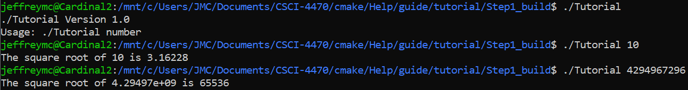
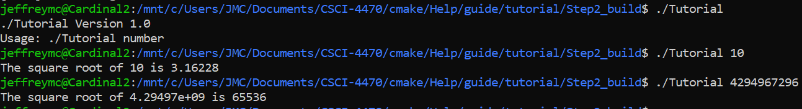
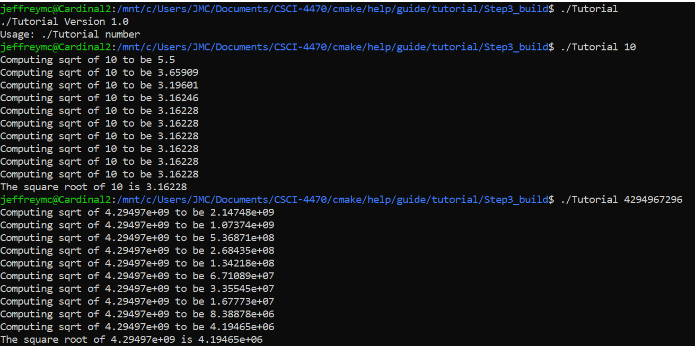
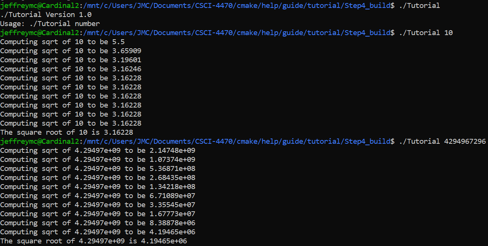
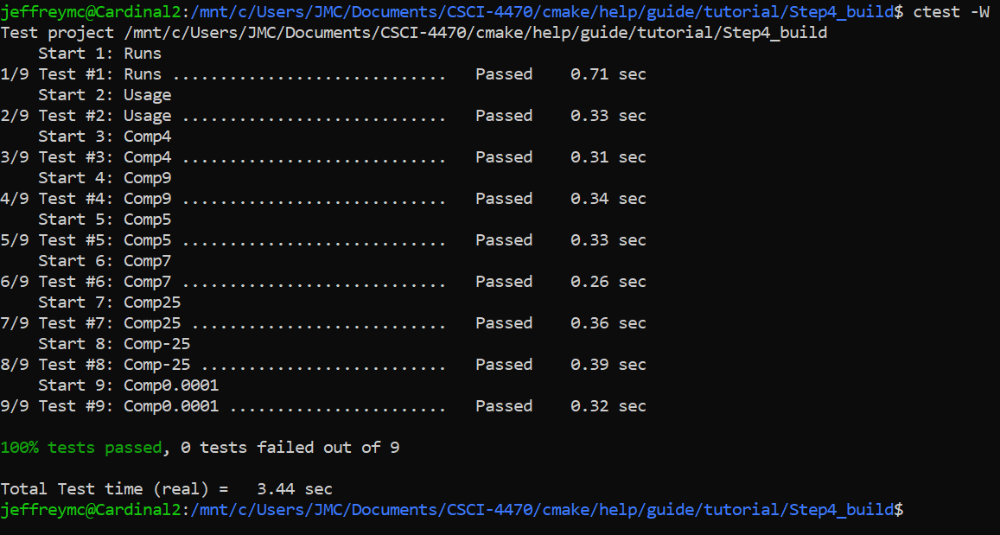
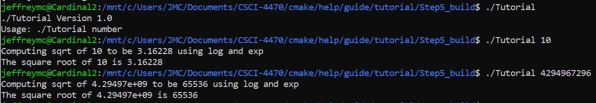
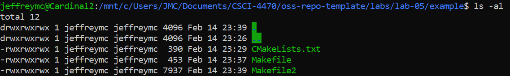

# Lab 05 - Build Systems

## Step 1

[CMakeLists.txt](Step1/CMakeLists.txt)

## Step 2

[CMakeLists.txt](Step2/CMakeLists.txt)

## Step 3

- [CMakeLists.txt](Step3/CMakeLists.txt)
- [MathFunctions/CMakeLists.txt](Step3/MathCMakeLists.txt)

## Step 4

- [CMakeLists.txt](Step4/CMakeLists.txt)
- [MathFunctions/CMakeLists.txt](Step4/MathCMakeLists.txt)

Result from ctest:

## Step 5

- [CMakeLists.txt](Step5/CMakeLists.txt)
- [MathFunctions/CMakeLists.txt](Step5/MathCMakeLists.txt)

## Create Your Own Makefile

- [CMakeLists.txt](example/CMakeLists.txt)
- [Custom Makefile](example/Makefile)
- [Created Makefile from C](example/Makefile2)

Compare Sizes:

Results (all were the same):

