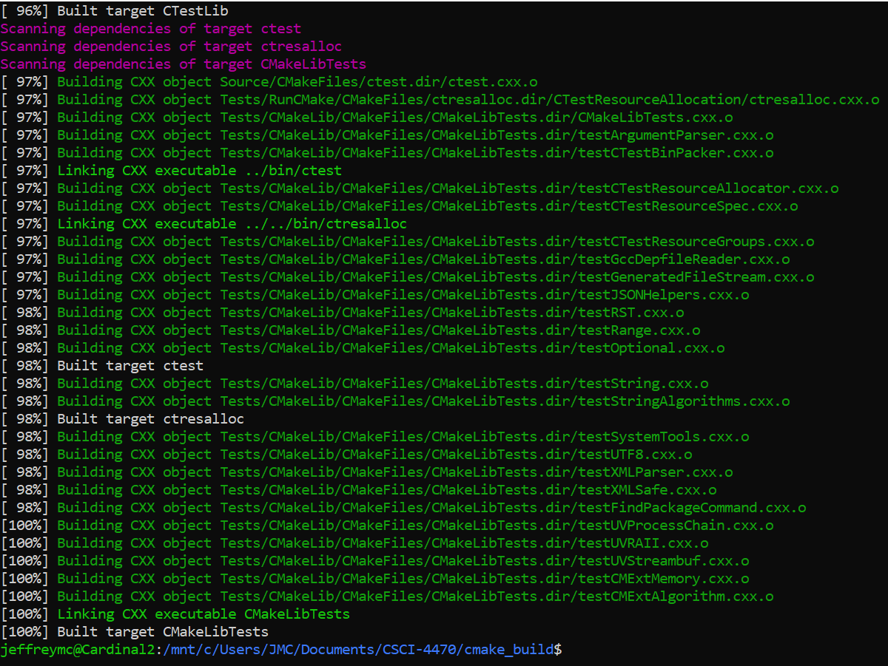
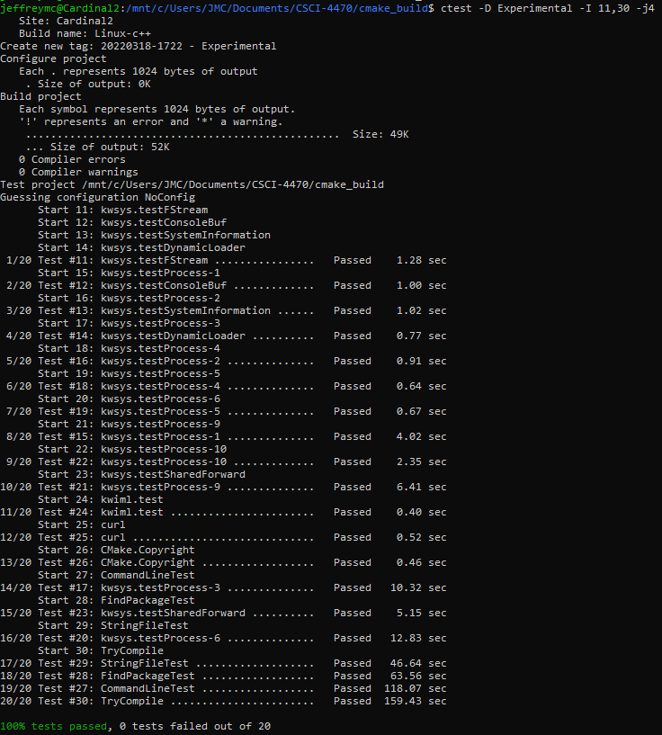
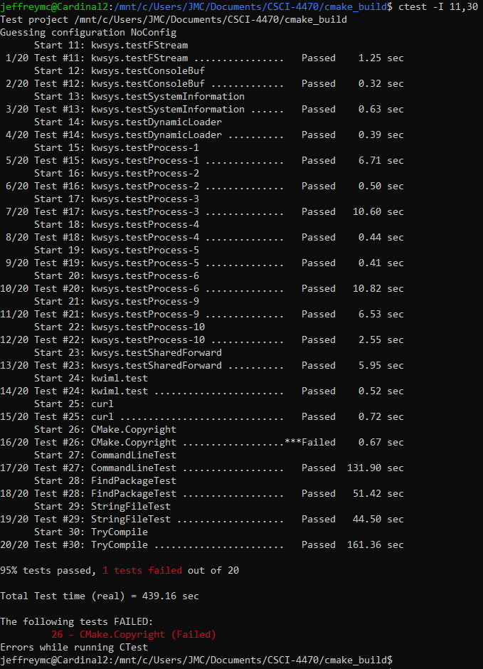
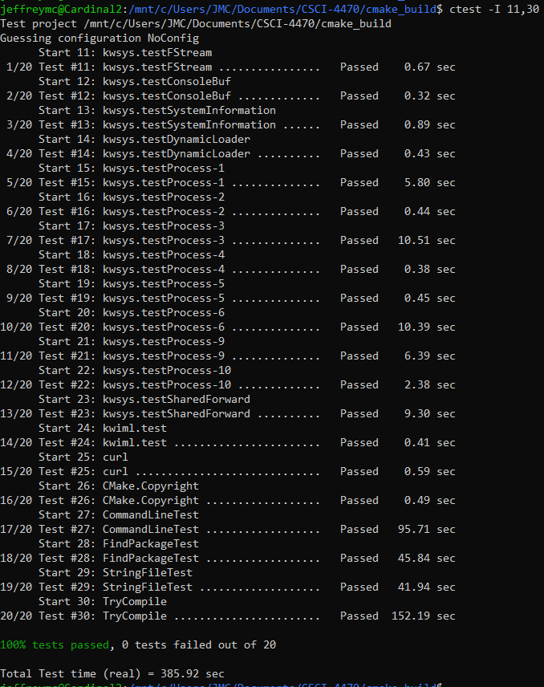
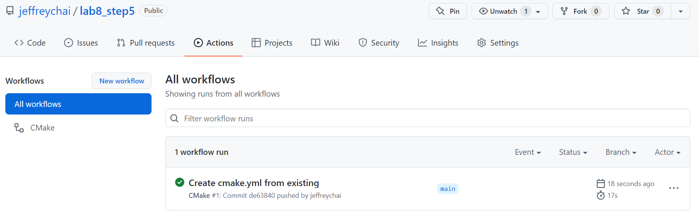
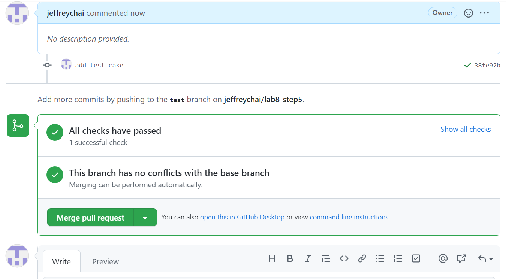
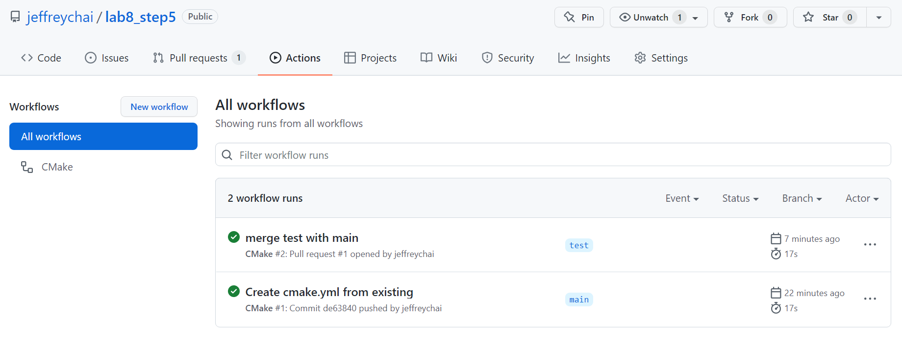

# Lab 08 - Testing and Continuous Integration

## Checkpoint 1

Screenshot of completed build:

## Checkpoint 2

### 2.1

We can see which tests failed or passed under the number on the main screen.
If we click the passed number, we can see a list of all the test that were run and passed.
In the experimental section, there are 20 tests for each build.
In the nightly section, there are 691 tests for each build. Here are the Nightly tests that were passed:
https://open.cdash.org/viewTest.php?onlypassed&buildid=7802189

For Nightly, there are 2 that failed due to RunCMake.CompatibleInterface; for experimental, there is failure due to CMake.Copyright.

This is a build that is similar to mine. 
The build appears "clean" and it has no errors associated with it, so there is no reason for me to be concerned.
Link: https://open.cdash.org/build/7801279

### 2.3

This is my test that is on the website since the name of my machine is Cardinal2. There are no errors.

Link: https://open.cdash.org/viewSite.php?siteid=90596&project=1&currenttime=1647565200

### 2.4

Passed on local terminal:

## Checkpoint 3

Failed Test:

To fix the error, I changed the year in the copyright file from 2020 to 2022.
Below is the passed test:

## Checkpoint 4

Repo Link: https://github.com/jeffreychai/lab8_step5

Tests still execute:

Verify that all tests still run on the test branch:

Screenshot of both workflows passed:

