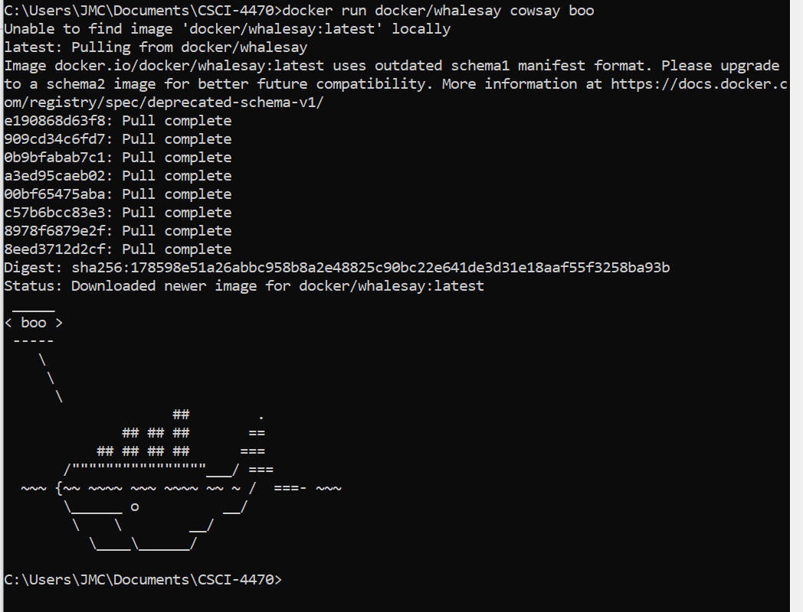
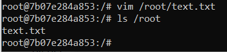
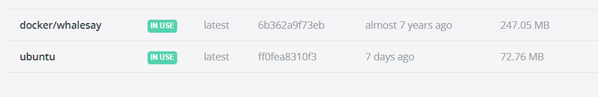
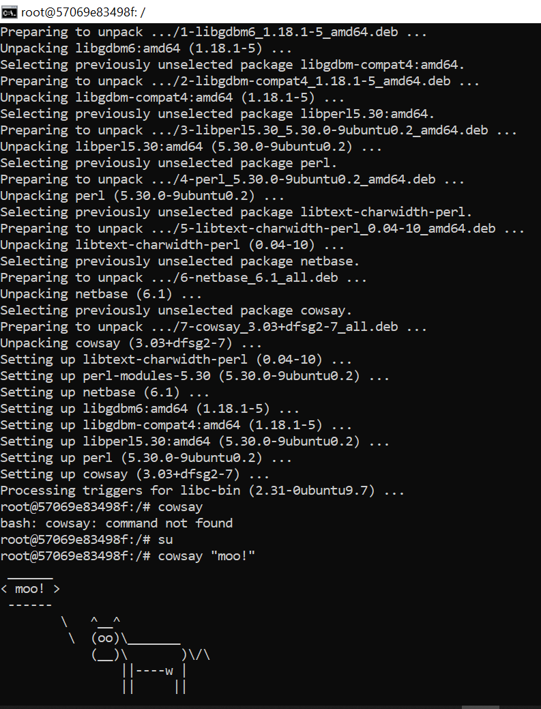
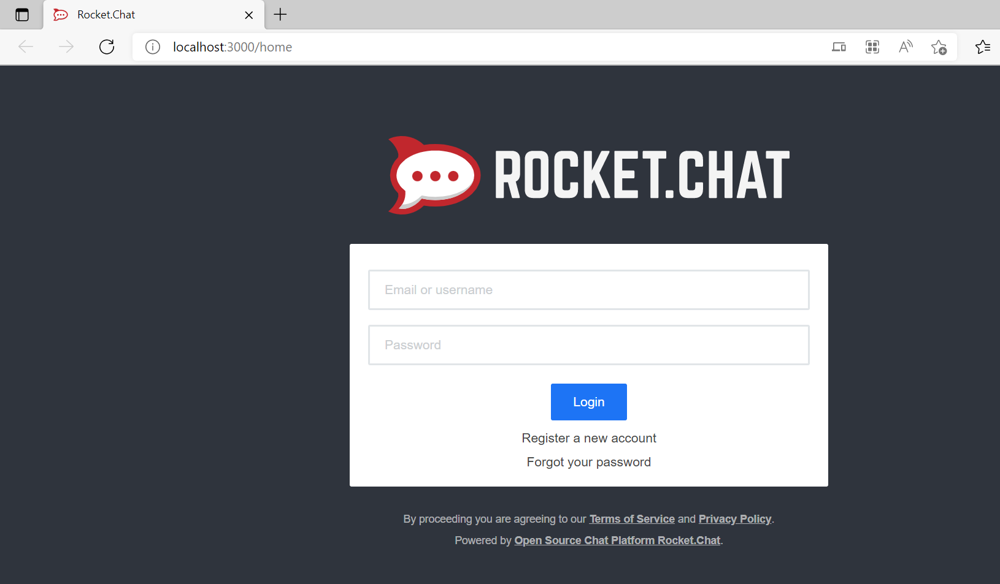
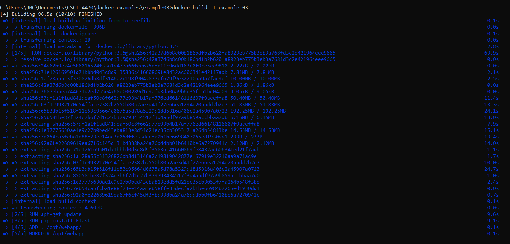
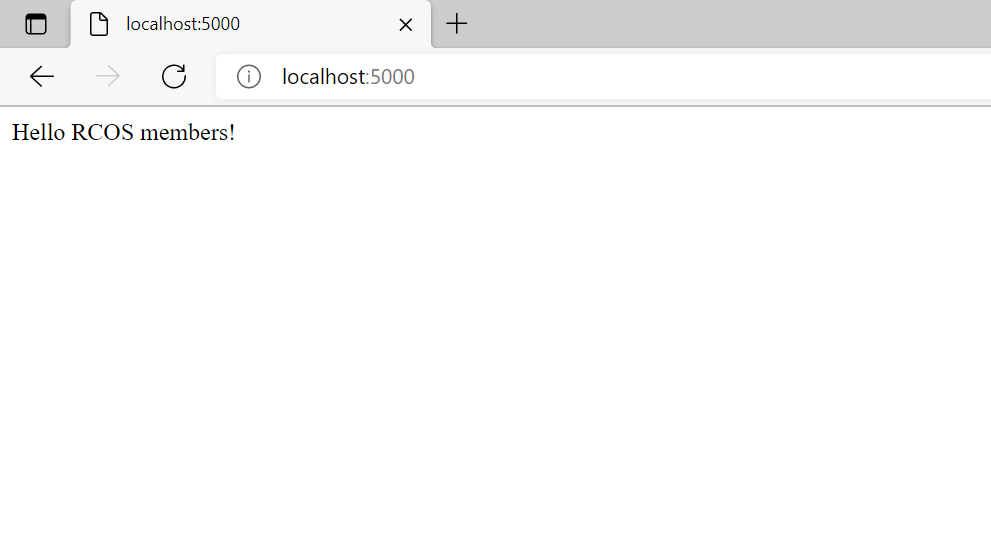
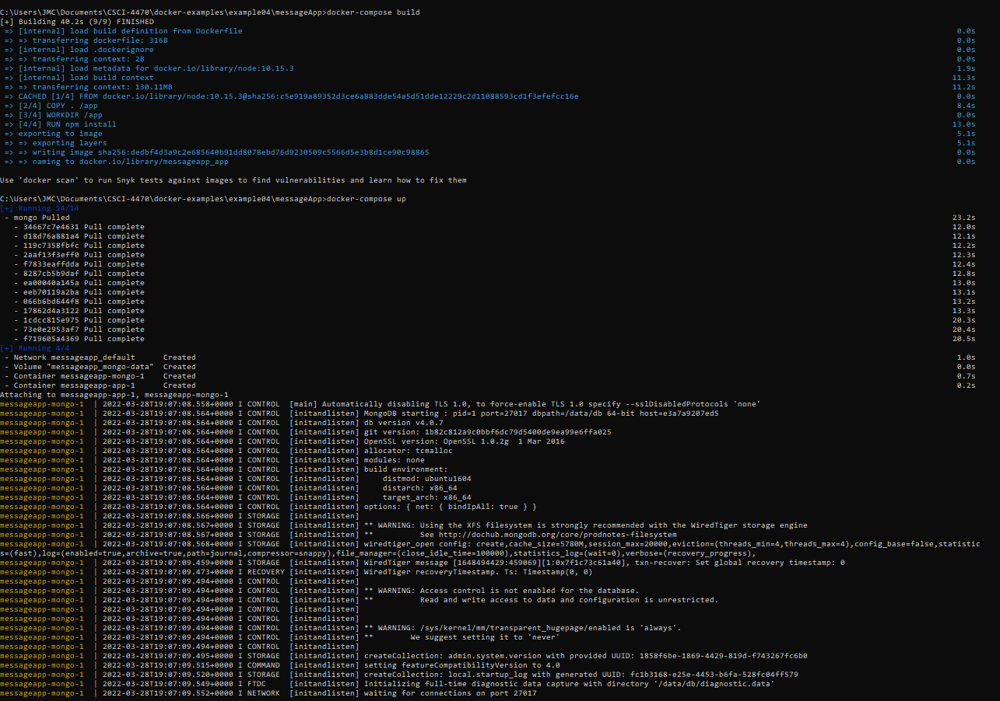
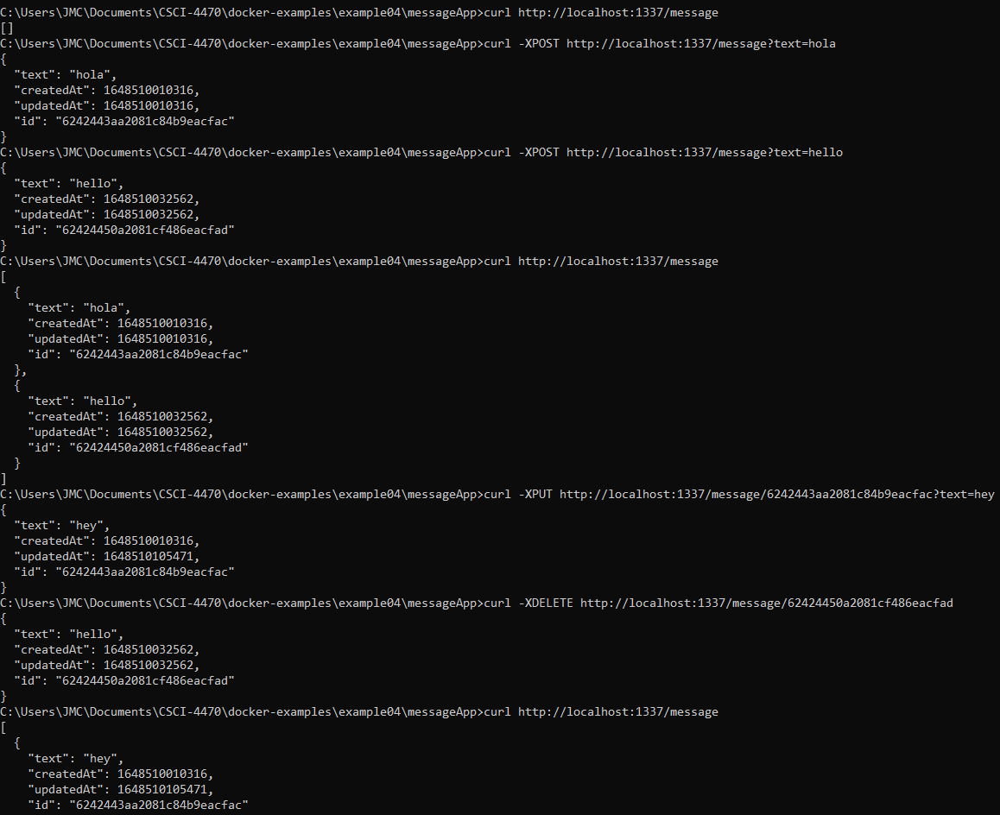

# Lab 09 - Virtualization and Docker

## example00

Testing Docker installation:

## example01

Setup whalesay:

Docker Desktop display:

Playing with cowsay:

## example02

Terminal:

RocketChat:

## example03

Build:

Successful Connection:

## example04

List Images:

Docker Build and Up commands:

Messages:

