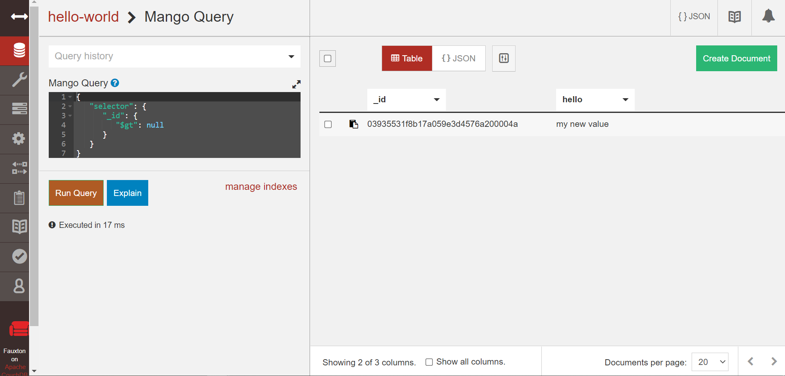

# Lab 10 - Databases

## Checkpoint 0

I decided to analyze the incident with the Faker.js and Color.js libraries.

Link to blog entry: https://github.com/jeffreychai/oss-repo-template/wiki/Open-Source-Attack-(Week-10)

## Checkpoint 1: Install CouchDB

Localhost Message:

Now we know that the database is working properly on the local machine.

## Checkpoint 2: Quick Tour

Need to login:

Curl Example (Terminal):

Query 1

Query 2

Start to Duplicate

Fully Duplicated:

## Checkpoint 3: API Tutorial

Server

Albums-Backup

Add First Document:

Database & Revisions:

Documents in Detail:

Attachments:

Visit URL on Browser:

Albums-Replica (Replication):

## Checkpoint 4

### 4.1 - Year Query

### 4.2 - Title Query

### 4.3 - New Index

### 4.4 - Run Title Query Again

For this part, I adapted the given command to create an index, and then reran the query.
Thus, there is no longer a warning since the query is optimized.
