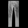

# Lab 11 Report - TensorFlow

## Checkpoint 1

Screenshot of pop-up:

## Checkpoint 2

Screenshot of plot:

## Checkpoint 3

In order to perform the operations of grayscale, rescaling to 28 x 28, inverting, and scale between 0 and 1, I used the libraries of Image, ImageOps from PIL. I applied these operations to each image.

Original Image #1:

Transformed Image #1 (Grayscale):

Transformed Image #1 (All):

Original Image #2:

Transformed Image #2 (Grayscale):

Transformed Image #2 (All):

Original Image #3:

Transformed Image #3 (Grayscale):

Transformed Image #3 (All):

Test Prediction Accuracy (Grayscale):

Test Prediction Accuracy (All):

Conclusion:

#1 is a dress shirt, but it was classified as coat.
#2 is a shoe, but it was classified as bag.
#3 is pants, but it was classified as trouser.

Therefore, there are inaccuracies. 
